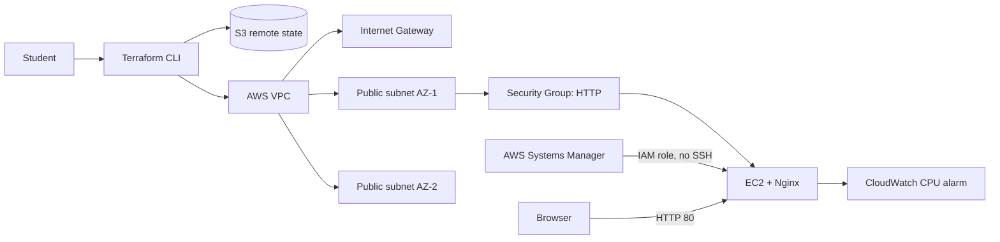

# Terraform AWS Foundations Lab

[Русский](README.md) | [English](README_EN.md)

Эталонный проект преподавателя для практики Infrastructure as Code. Terraform
создаёт недорогую AWS-инфраструктуру: VPC, две public subnet в разных Availability
Zones, Internet Gateway, routing, Security Group и EC2 с Nginx. IAM instance
profile даёт доступ через Systems Manager без SSH, а CloudWatch контролирует CPU.

## Место в учебной программе

Проект выполняется после основ Terraform и AWS, перед Kubernetes Todo и CloudOps
Capstone. Ожидаемая продолжительность — 1–2 недели.



## Структура

- `bootstrap/` — отдельный state для создания защищённого S3 backend;
- `modules/network/` — reusable network module;
- `modules/web-server/` — EC2, Security Group и Nginx;
- `environments/dev/` — composition root среды dev;
- `.github/workflows/terraform.yml` — fmt и validate без AWS credentials.

Объяснение `root module`, `child modules`, `variables`, `locals`, `data sources`
и `outputs`: [TERRAFORM_CONCEPTS.md](TERRAFORM_CONCEPTS.md).

## Предварительные требования

- Terraform 1.10+ (для native S3 state locking);
- AWS CLI v2;
- учебный AWS account и настроенная аутентификация;
- Git.

Проверьте identity перед созданием ресурсов:

```bash
aws sts get-caller-identity
terraform version
```

## Запуск

Сначала создайте S3 bucket для state:

```bash
cd bootstrap
terraform init
terraform apply
terraform output state_bucket_name
```

Скопируйте `environments/dev/backend.hcl.example` в `backend.hcl`, замените имя
bucket результатом output и выполните:

```bash
cd ../environments/dev
cp backend.hcl.example backend.hcl
cp terraform.tfvars.example terraform.tfvars
terraform init -backend-config=backend.hcl
terraform fmt -check -recursive
terraform validate
terraform plan -out=tfplan
terraform apply tfplan
terraform output website_url
```

Откройте `website_url` в браузере. SSH специально не открыт: Nginx устанавливается
через `user_data`, EC2 требует IMDSv2, а административный доступ выполняется
через AWS Systems Manager Session Manager:

```bash
aws ssm start-session --target "$(terraform output -raw instance_id)"
```

## Cleanup

Сначала удалите workload, затем при необходимости state bucket. У bucket включён
`prevent_destroy`, поэтому удалять его следует только осознанно после удаления
state versions.

```bash
cd environments/dev
terraform destroy
```

## Для преподавателя

Студентам выдаётся отдельный репозиторий `terraform-aws-starter`. Это repository
содержит эталонную реализацию и не должен открываться студентам до защиты.
